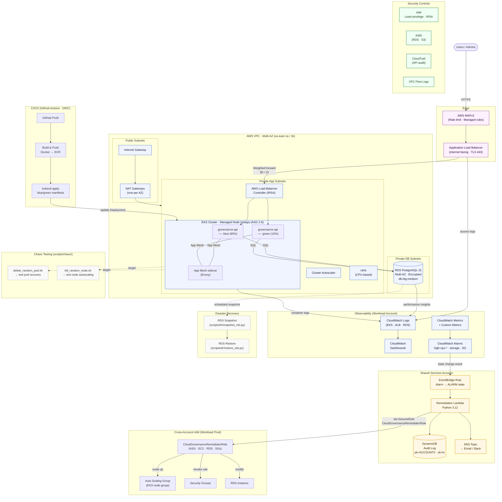

# CloudSentinel – Architecture Overview

An event-driven AWS governance and auto-remediation platform spanning multiple accounts.
All infrastructure is Terraform-managed. Deployments are blue/green with weighted ALB routing.

---

## Multi-Account Structure

```
AWS Organizations (Management Account)
│
├── Security Account          ← GuardDuty admin, CloudTrail aggregation (planned)
├── Shared Services Account   ← Remediation Lambda, DynamoDB audit, SNS, EventBridge
└── Workload Prod Account     ← VPC, EKS, RDS, WAF, ALB, App Mesh
```

---

## Full Architecture Diagram



---

## Remediation Flow (Step by Step)

```
EKS Node CPU > 90% (10 min)
  │
  ▼
CloudWatch Metric Alarm  →  state: ALARM
  │
  ▼
EventBridge Rule  (source: aws.cloudwatch, alarmName prefix: high-cpu-)
  │
  ▼
Remediation Lambda  (Shared Services account)
  │   ├── sts:AssumeRole  →  CloudGovernanceRemediatorRole  (Workload account)
  │   ├── autoscaling:UpdateAutoScalingGroup  (desired += N)
  │   ├── DynamoDB PutItem  (audit record: pk=ACCOUNT#<id>, sk=<ts>)
  │   └── SNS Publish  (email notification)
  │
  ▼
Auto Scaling Group scales up  →  CloudWatch alarm recovers  →  OK state
```

---

## Blue / Green Deployment Flow

```
New image pushed to ECR
  │
  ▼
GitHub Actions  →  kubectl set image deployment/governance-api-green
  │
  ▼
ALB Weighted Target Groups
  ├── Blue  (stable)  ──  90% traffic
  └── Green (canary)  ──  10% traffic
  │
  ▼
Validate metrics in CloudWatch
  │
  ├── Healthy  →  shift to 100% green, retire blue
  └── Issues   →  shift back to 100% blue (rollback)
```

---

## Key Design Decisions

| Decision | Choice | Why |
|---|---|---|
| Ingress | AWS ALB Controller (IRSA) | Native integration with WAF + ACM, weighted routing |
| Service mesh | App Mesh (Envoy sidecar) | AWS-native, no separate control plane cost |
| Deployments | Blue/Green via weighted ALB | Zero-downtime, instant rollback |
| Remediation | Cross-account Lambda via STS | Central control plane, least-privilege per account |
| Audit log | DynamoDB (pk + sk) | Serverless, per-account query by pk, TTL for cost |
| Secrets | IRSA everywhere | No long-lived credentials in pods or Lambda |
| IaC | Terraform modules | Reusable, state-tracked, PR-reviewable |
